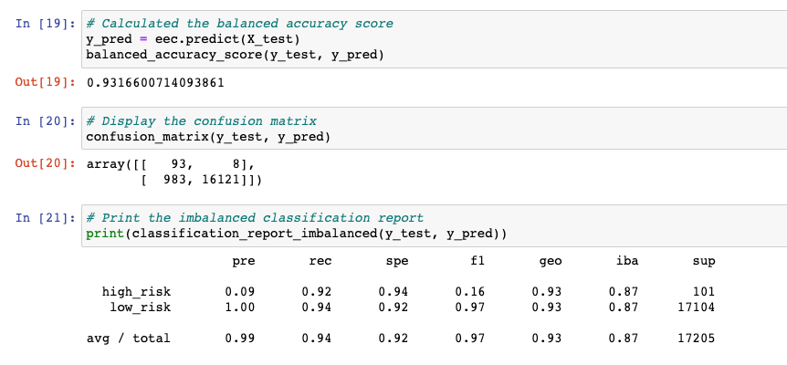
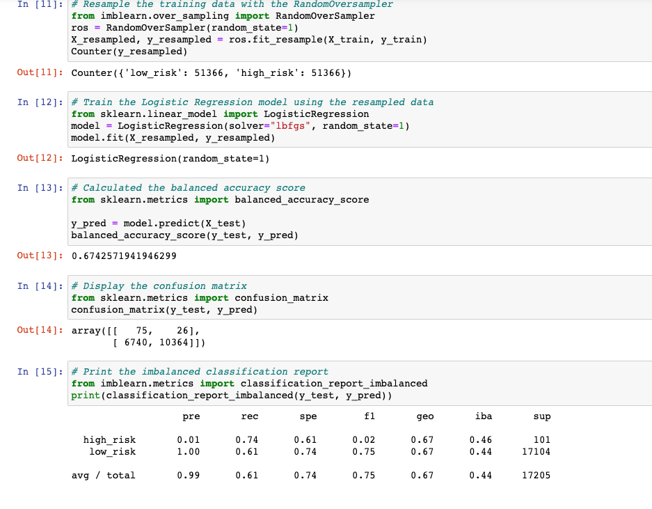
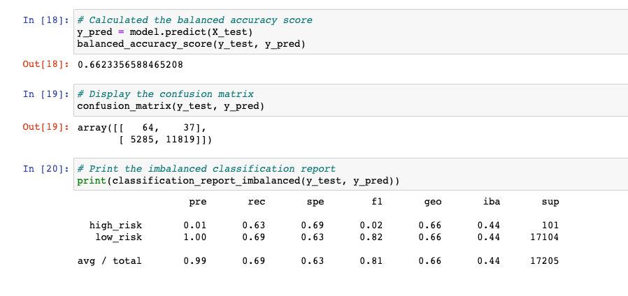
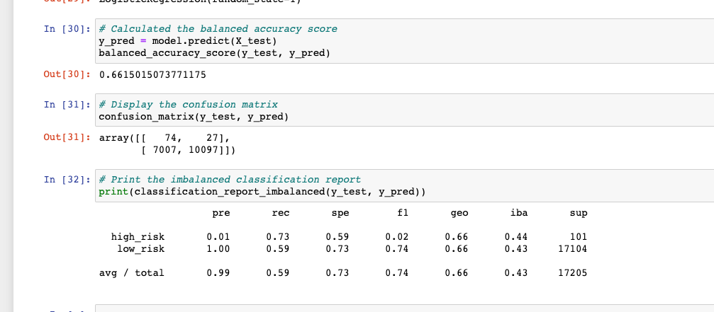
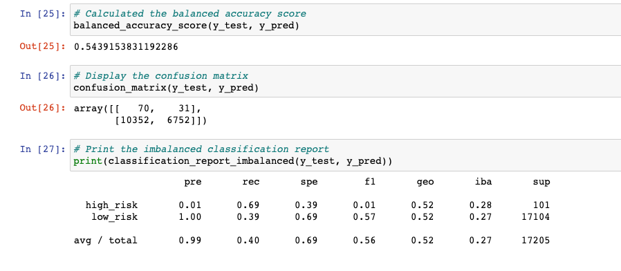

# Credit_Risk_Analysis
## Overview of the project
Credit risk is an inherently unbalanced classification problem, as good loans easily outnumber risky loans. Therefore, we need to employ different techniques to train and evaluate models with unbalanced classes. Using the credit card credit dataset from LendingClub, a peer-to-peer lending services company, I’ll oversample the data using the RandomOverSampler and SMOTE algorithms, and undersample the data using the ClusterCentroids algorithm. Then, I used a combinatorial approach of over- and undersampling using the SMOTEENN algorithm. Next, I compared two new machine learning models that reduce bias, BalancedRandomForestClassifier and EasyEnsembleClassifier, to predict credit risk. I evaluated the performance of these models and make a written recommendation on whether they should be used to predict credit risk.

## Results
### Balanced Random Forest Classifier

### Easy Ensemble Classifier

### Random Over Sampler

### SMOTE Over Sampling

### SMOTEEN

### Under Sampling (ClusterCentroids)

## Summary
In order to figure out which models are good at predicting high risk credit id if the accuracy score is high. (70+) If it is below 70 then it doesn't have a good accuracy score. EEC would be considered the best in this scenario. 
